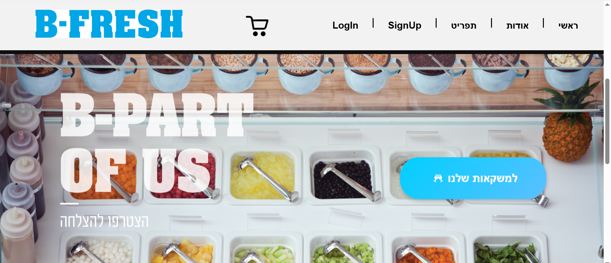

# 🥤 B-Fresh - חנות משקאות אונליין

ברוכים הבאים ל-**B-Fresh** — חנות אינטרנטית למשקאות מרעננים!  
זהו פרויקט סיום שנבנה במסגרת הלימודים שלי כחנות דיגיטלית מלאה (מקצה לקצה), הכוללת מערכת ניהול הזמנות, הרשמה וכניסת משתמשים.

הפרויקט נבנה באמצעות React, Node.js ו-MongoDB.

---

## ✨ פיצ'רים עיקריים

✅ עמוד בית מעוצב ומזמין  
✅ עמוד תפריט המציג את כל המשקאות הקיימים למכירה  
✅ מערכת הרשמה וכניסה (Login / Register)  
✅ אפשרות להוספת משקאות לעגלת קניות  
✅ עגלת קניות עם סיכום הזמנה  
✅ תהליך הזמנה מלא  
✅ עמוד "ההזמנות שלי" — צפייה בהיסטוריית ההזמנות  

---

## 🗂️ פירוט העמודים בפרויקט

### 🏠 עמוד הבית

- עמוד ראשי מעוצב המזמין את המשתמש להיכנס לחנות ולהתרשם מהמוצרים.
- הצגת סלוגן ותמונות מושכות של משקאות.

### 🍹 עמוד התפריט (Menu)

- הצגת רשימת כל המשקאות הקיימים למכירה.
- לכל משקה מוצג:
  - תמונה
  - שם המוצר
  - מחיר
  - כפתור "הוסף לעגלה".

### 🛒 עגלת קניות

- מציגה את כל המוצרים שהמשתמש הוסיף לעגלה.
- סיכום הזמנה הכולל מחיר כולל.
- אפשרות להסרת מוצרים מהעגלה.
- כפתור "בצע הזמנה".

### 📝 תהליך הרשמה / כניסה

- משתמש חדש יכול להירשם למערכת באמצעות טופס הרשמה.
- משתמש קיים יכול להיכנס באמצעות טופס כניסה (Login).
- לאחר התחברות — המשתמש יכול לבצע הזמנות ולצפות בהיסטוריה האישית שלו.

### 📦 עמוד "ההזמנות שלי"

- מציג את כל ההזמנות שביצע המשתמש.
- עבור כל הזמנה מוצגים:
  - מספר הזמנה
  - תאריך
  - רשימת משקאות שהוזמנו
  - מחיר סופי.

---

## 🖥️ טכנולוגיות בשימוש

- **Frontend:** React
- **Backend:** Node.js + Express.js
- **Database:** MongoDB
- **Version Control:** Git + GitHub

---
## 📸 תמונות מהפרויקט

### עמוד הבית  
  
  
  

### עמוד התפריט  
  
  

### עמוד אודות   
  
  
  
  
  
  

### עגלת קניות  
  
  

### תשלום  
  
  
  
  

### עמוד ההזמנות שלי  
  
  
  

### איתור סניפים   
  
  

### עמוד הרשמה / כניסה  
  
  


לצפייה בהדגמה של הפרויקט [לחצו כאן](https://drive.google.com/file/d/1Cr1nPI06Rxj4ByaXOvOSlpRU6rLYjz2s/view?usp=sharing)


---

## 🚀 איך מריצים את הפרויקט

### Clone את הריפוזיטורי:

```bash
git clone https://github.com/TamarDaniea/b-fresh.git
